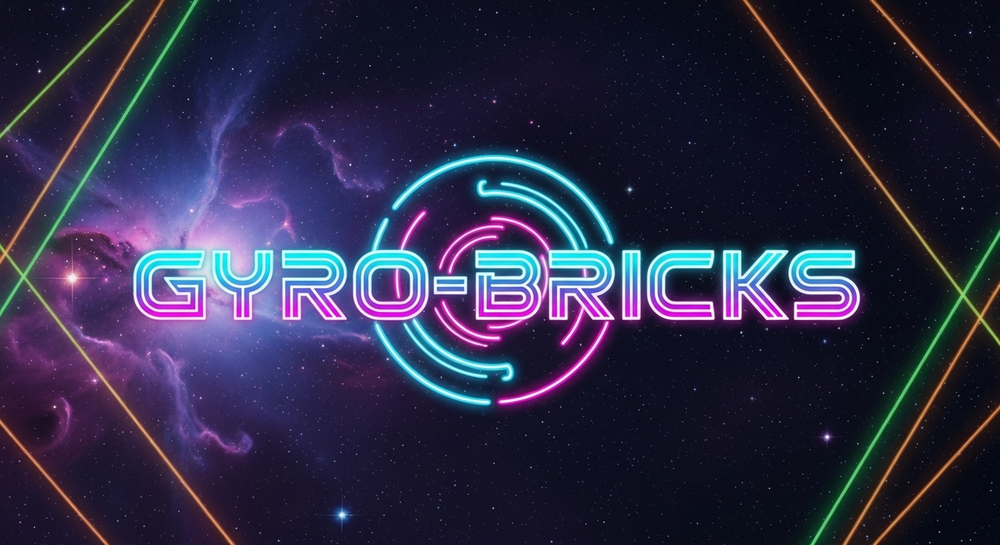

Gyro-Bricks: Special Edition propulse le genre classique du casse-briques dans une nouvelle dimension avec son arène circulaire dynamique à 360°. Plongez dans un univers rétro-futuriste où vos réflexes, votre stratégie et votre capacité à maîtriser le chaos seront mis à rude épreuve.

<a href="https://hisammmmmmmm.github.io/gyro-bricks/">
<strong> jouer à Gyro-Bricks maintenant ! »</strong>
</a>

Table des Matières

À Propos du Jeu

Caractéristiques Principales

Modes de Jeu

Comment Jouer

Commandes

Technologies Utilisées

Crédits et Remerciements

Licence

À Propos du Jeu

Le principe est familier : un paddle, une balle, et des briques à détruire. Mais la révolution est dans l'arène. Au lieu d'un simple mouvement horizontal, vous contrôlez votre paddle sur un périmètre circulaire complet, protégeant le cœur d'un réacteur contre des vagues de briques de plus en plus menaçantes.

Ce gameplay unique crée des trajectoires imprévisibles, des réactions en chaîne explosives et demande une stratégie totalement nouvelle.

Caractéristiques Principales

🌀 Arène Dynamique à 360° : Anticipez des rebonds complexes et couvrez tous les angles pour survivre.

🎨 Esthétique Rétro-Futuriste : Plongez dans une ambiance néon-lumineuse inspirée de la science-fiction des années 80, avec une bande-son techno entraînante.

🚀 Système de Pouvoirs Stratégiques : Collectez du mana et déchaînez des capacités dévastatrices comme des Explosions, des Super Coups ou l'Attraction de la Balle.

🧱 Des Briques aux Effets Uniques : Affrontez des briques Tireuses, Mobiles, Régénératrices ou encore de Chaos.

🏆 Plus de 100 Succès : Des défis simples aux exploits légendaires, prouvez votre maîtrise du jeu.

📊 Statistiques Détaillées : Suivez vos performances, vos meilleurs scores et votre progression.

📱 Multi-plateforme : Jouez avec précision sur ordinateur (souris/clavier) ou en déplacement grâce à des commandes tactiles optimisées.

Modes de Jeu

Mode Normal : La campagne principale. Progressez à travers des niveaux de difficulté croissante et affrontez des boss redoutables tous les cinq niveaux.

Mode Boss Fight : L'épreuve d'habileté pure. Plus de briques, juste vous contre des boss titanesques dans des combats chronométrés.

Mode Survie (Faille Temporelle) : Survivez le plus longtemps possible face à des vagues de briques infinies tandis que l'arène se rétrécit inexorablement.

Mode Puzzle : Un défi cérébral. Avec un seul lancer, trouvez la trajectoire parfaite pour atteindre la cible en un minimum de rebonds.

Comment Jouer
Jouer en Ligne

La manière la plus simple de jouer est de se rendre sur le lien suivant :

jouer à Gyro-Bricks
(Remplacez ce lien par l'URL où vous hébergez le jeu, par exemple votre lien GitHub Pages)

Commandes
Action	Commande Souris/Clavier	Commande Tactile (Paysage)
Déplacer le Paddle	Mouvement de la souris	Glisser sur la zone extérieure droite de l'écran
Lancer la Balle / Pouvoir 1	Clic Gauche / Espace	Appuyer sur la zone intérieure droite de l'écran
Pouvoir 2	Clic Droit / Entrée	Appuyer sur le deuxième bouton de pouvoir à gauche
Changer la Vitesse	Molette / Flèches Haut & Bas	Utiliser le slider de vitesse en bas à gauche
Activer Pouvoir 1 (mobile)	-	Appuyer sur le premier bouton de pouvoir à gauche
Technologies Utilisées

Ce jeu est construit entièrement avec des technologies web standard, sans aucune dépendance externe (framework).

HTML5

CSS3

JavaScript (ES6+)

Crédits et Remerciements

Musiques : Les musiques libres de droits proviennent de la chaîne YouTube Infraction & NCM.

Effets Sonores : Les effets sonores ont été téléchargés depuis Pixabay (https://pixabay.com/fr/sound-effects/).

Développement : Ce jeu a été développé par HMZ avec l'aide des outils d'intelligence artificielle Gemini Pro (Google) et Kimi K2 (Moonshot AI).

Licence

Ce projet est distribué sous la licence MIT. Voir le fichier LICENSE.txt pour plus de détails.
